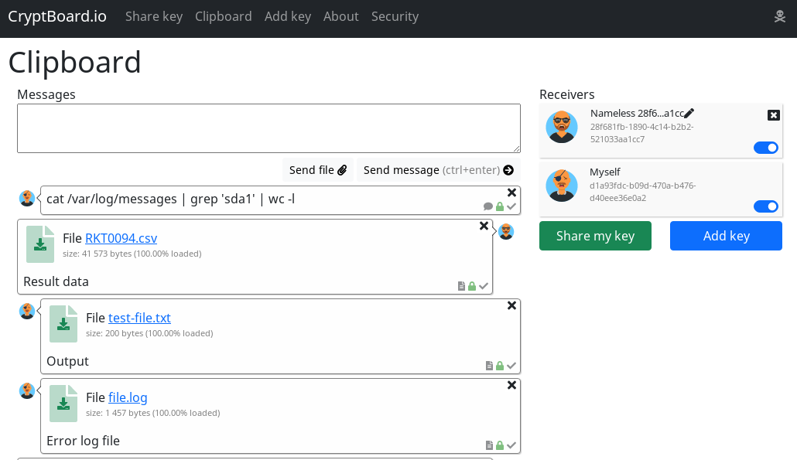

# CryptBoard.io - anonymous encrytped web clipboard

Cryptboard.io allows to send text and files between multiple devices with security and anonymity in mind.

Website: https://cryptboard.io/

## Features

* Anonymous authorization on server without need of registration
* Hybrid RSA+AES encryption of data with asymetric keys
* All sent data encrypted on the client and could not be decrytped on server
* Clients adding each other to the "receviers list" by sending theis public key and user ID by third-party channel
* Possible to share public key user ID by scanning QR-code
* Single button click to clear all client's data and keys and start new session

## Disclaimers

* Application is on it's beta stage so some bugs could be out where
* Application is written initially for my own use so code isn't perfect and would be refactored later
* Design is made by a backend programmer

